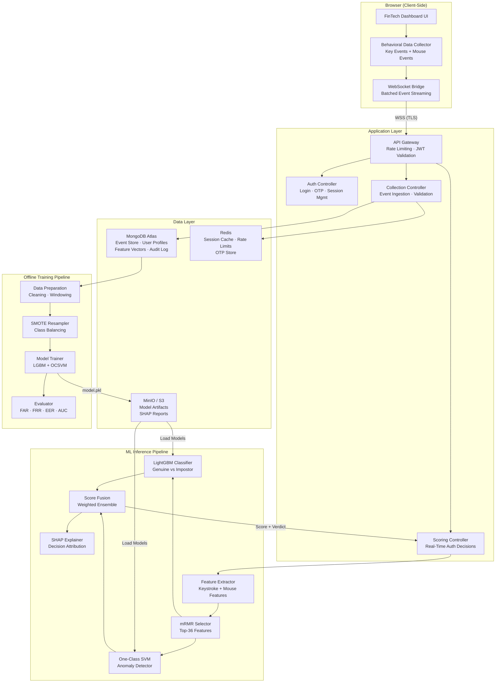
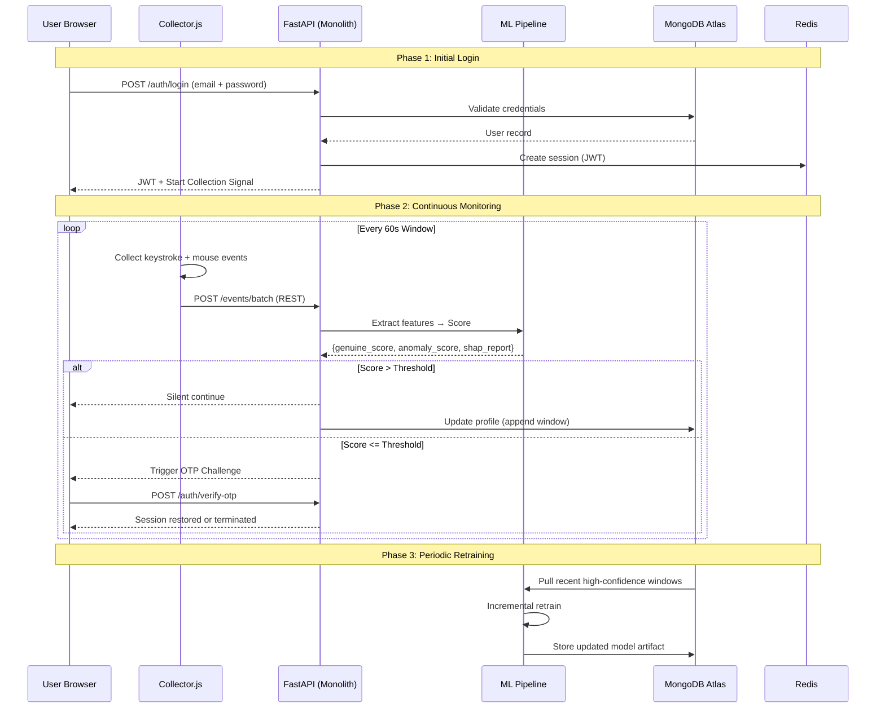
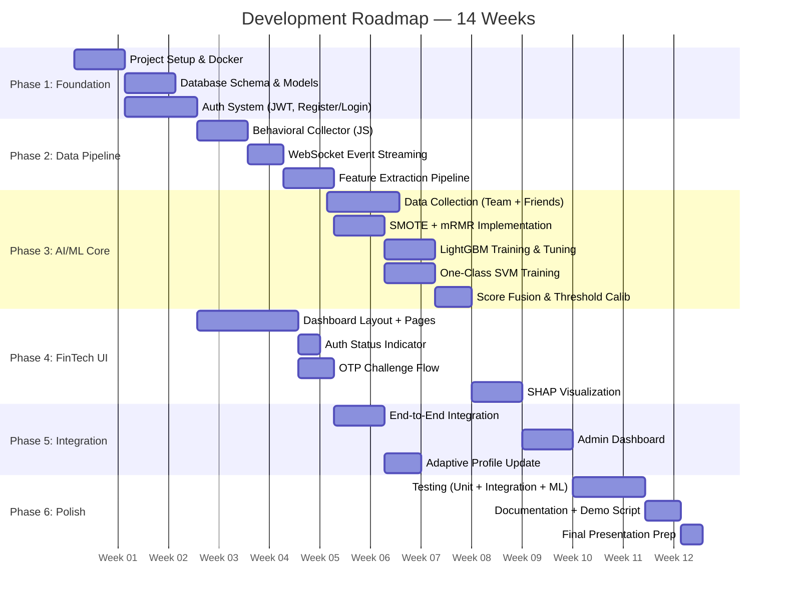

# Adaptive Continuous User Authentication Using Behavioral Biometrics

## Software Architecture Document · AI/ML Implementation Blueprint · Technical Execution Guide

**B.Tech Computer Engineering — Major Project (Group 17)**
**Pillai College of Engineering, University of Mumbai · 2025–2026**

---

## Table of Contents

1. [Project Overview & Vision](#1-project-overview--vision)
2. [Critical Evaluation: FinTech Implementation vs Alternatives](#2-critical-evaluation-fintech-implementation-vs-alternatives)
3. [System Architecture](#3-system-architecture)
4. [Core Features & Modules](#4-core-features--modules)
5. [Technology Stack](#5-technology-stack)
6. [AI/ML Implementation Blueprint](#6-aiml-implementation-blueprint)
7. [Database Design](#7-database-design)
8. [API Design](#8-api-design)
9. [Frontend Design](#9-frontend-design)
10. [Development Roadmap](#10-development-roadmap)
11. [Deployment Strategy](#11-deployment-strategy)
12. [Testing Strategy](#12-testing-strategy)
13. [Security Implementation](#13-security-implementation)
14. [Project Folder Structure](#14-project-folder-structure)
15. [Git Workflow & CI/CD](#15-git-workflow--cicd)
16. [Risk Management](#16-risk-management)
17. [Future Scope & Research Directions](#17-future-scope--research-directions)
18. [Deliverables & References](#18-deliverables--references)

---

## 1. Project Overview & Vision

### 1.1 The Problem

Traditional authentication (passwords, PINs, OTPs) is a **single-point gate**. Once a user logs in, the system has zero ability to verify that the same legitimate user is still at the keyboard. This creates an enormous attack surface:

- **Session hijacking** — an attacker takes over an already-authenticated session
- **Insider threats** — legitimate credentials used by unauthorized actors
- **Device theft** — post-login device compromise with full session access
- **Coercion** — a legitimate user forced to authenticate under duress

Identity theft losses reached approximately **USD 43 billion annually** according to industry reports. The fundamental flaw is architectural: authentication happens once, then trust is assumed indefinitely.

### 1.2 Our Solution

A **Secure Adaptive Multimodal Continuous Authentication System** that silently verifies user identity throughout the entire session by analyzing how they interact with their keyboard and mouse — behavioral patterns that are unique, difficult to forge, and impossible to steal.

The system extracts behavioral features (keystroke hold time, flight time, typing rhythm, cursor speed, trajectory curvature, click patterns), selects the most discriminative features using mRMR, balances training data with SMOTE, and deploys a hybrid model (LightGBM classifier + One-Class SVM anomaly detector) that continuously scores user behavior against their stored profile. When anomalies are detected, step-up authentication (OTP) is triggered. Critically, the user's behavioral profile **adapts over time** through a sliding-window update mechanism, accommodating natural evolution in typing speed, new keyboards, fatigue, and aging.

### 1.3 Scope & Intended Users

| Dimension | Scope |
|---|---|
| **Modalities** | Keystroke dynamics + Mouse dynamics (hybrid) |
| **Delivery** | Web-based application (browser-accessible) |
| **Environment** | Desktop/laptop users with standard keyboard + mouse |
| **Primary Domains** | Online banking, enterprise systems, secure web portals |
| **ML Models** | LightGBM (supervised) + One-Class SVM (anomaly detection) |
| **Adaptivity** | Sliding-window profile update with periodic model retraining |
| **Explainability** | SHAP values for audit-ready authentication decisions |

---

## 2. Critical Evaluation: FinTech Implementation vs Alternatives

### 2.1 Decision Matrix

The implementation domain must be selected against nine weighted criteria. Each domain is scored 1–10 and weighted by importance.

| Criteria | Weight | FinTech Web App | Enterprise SSO | Standalone Desktop Agent | Mobile Banking App | Academic Demo Portal |
|---|---|---|---|---|---|---|
| Innovation | 0.15 | **9** | 7 | 6 | 8 | 5 |
| Industry Relevance | 0.15 | **10** | 9 | 5 | 8 | 4 |
| AI/ML Complexity | 0.15 | 8 | 7 | 7 | 8 | **9** |
| Resume Value | 0.12 | **10** | 8 | 5 | 7 | 4 |
| Research Alignment | 0.10 | 8 | 7 | 6 | 8 | **10** |
| Scalability | 0.10 | **9** | **9** | 4 | 7 | 6 |
| Practical Deployment | 0.08 | **9** | 8 | 5 | 7 | 3 |
| Future Expansion | 0.08 | **9** | 8 | 5 | 7 | 6 |
| Ease of Demonstration | 0.07 | **9** | 6 | 6 | 7 | **9** |
| **Weighted Total** | **1.00** | **9.15** | 7.67 | 5.52 | 7.53 | 6.12 |

### 2.2 Analysis

**FinTech Web Application (Score: 9.15/10)** — *RECOMMENDED*

The FinTech domain is the optimal delivery vehicle for six reasons:

1. **Natural behavioral signal richness.** Banking workflows involve both heavy typing (beneficiary names, amounts, passwords, notes) and dense mouse interaction (navigation, form-filling, transaction confirmation). This dual-modality richness is precisely what the system needs for high-confidence authentication.

2. **Security expectations align.** FinTech users expect and tolerate security friction (OTP challenges, session timeouts) that would be unacceptable in social media or e-commerce. This allows the anomaly-triggered re-authentication mechanism to operate without harming user experience.

3. **Regulatory tailwinds.** RBI guidelines (mandating multi-factor auth for digital payments), PSD2/SCA in Europe, and FFIEC guidance in the US all push toward continuous risk-based authentication — our system directly addresses these requirements.

4. **Clear demo narrative.** "A banking session where the system silently verifies the user and only challenges when behavior deviates" is a compelling, easy-to-understand story for evaluators and potential employers.

5. **Resume differentiation.** A FinTech security product that uses behavioral ML with SHAP explainability is a stronger portfolio piece than a generic research demo.

6. **Scale path.** A FinTech app can be containerized, deployed on cloud, and demonstrated with real user data — it's production-grade by design, not by retrofit.

**Why not the alternatives:**

- **Enterprise SSO:** Requires integration with existing identity providers (Okta, Azure AD), which adds deployment complexity without adding technical depth to the ML pipeline.
- **Standalone Desktop Agent:** Native OS-level listeners (Windows hooks, macOS CGEvent) offer lower latency but are harder to demonstrate in a web browser, limit cross-platform reach, and feel like a research tool rather than a product.
- **Mobile Banking App:** Touchscreen and accelerometer data are scientifically rich but mobile behavioral biometrics is a different research track (sensor-based, not keyboard/mouse-based). Our 12-paper literature foundation is primarily desktop-focused.
- **Academic Demo Portal:** Aligns with research but sacrifices industry relevance and resume value. Evaluators see "yet another demo page" rather than "a product that could ship."

### 2.3 Recommended Execution

Build the system as a **FinTech Web Application** — a realistic banking dashboard (accounts, transfers, transaction history, beneficiary management) that embeds behavioral data collection transparently. The core deliverable is the continuous authentication engine; the banking UI is the vehicle, not the product. This gives a polished, professional demo that demonstrates both security engineering and AI/ML depth.

---

## 3. System Architecture

### 3.1 High-Level Architecture



### 3.2 Data Flow: Authentication Lifecycle



### 3.3 Component Architecture

The system follows a **monolithic FastAPI** architecture with domain-based modules (per ADR-0015):

| Layer | Technology | Purpose |
|---|---|---|
| **Client** | React 19 + TypeScript (TanStack Start) | FinTech dashboard; embeds behavioral collectors |
| **Backend** | FastAPI (Python 3.12) | Domain modules: auth, aegis, banking, admin; REST API |
| **ML Inference** | scikit-learn + lightgbm + SHAP (in-process) | Real-time feature extraction, scoring, explainability |
| **Model Training** | Python scripts (offline) | Data prep, SMOTE, training, evaluation |
| **Primary DB** | MongoDB Atlas (Motor + Beanie) | Async document model; heterogeneous behavioral data; flexible schema evolution |
| **Cache** | Redis 7 | Session state, OTP store, rate limit counters, scoring cache |
| **Object Store** | MinIO | Serialized models, SHAP reports |
| **Deployment** | Docker Compose | Single-host all-in-one deployment |

---

## 4. Core Features & Modules

### 4.1 Feature Catalogue

#### Phase 1 — User Enrollment & Profile Creation

| Feature | Description |
|---|---|
| **Account Registration** | Email + password signup; initial behavioral profiling during onboarding |
| **Baseline Collection** | 3–5 minute guided typing + mouse task during registration to build initial behavioral profile |
| **Profile Storage** | Feature vector template stored in MongoDB Atlas; model trained per-user |
| **Minimum Viable Profile** | System enforces minimum 120+ keystrokes and 60+ mouse movements before enabling continuous auth |

#### Phase 2 — FinTech Dashboard Features (The Vehicle)

| Feature | Description |
|---|---|
| **Account Overview** | Balance display, recent transactions (read-heavy, natural mouse movement) |
| **Fund Transfer** | Beneficiary selection, amount entry, confirmation — dense typing + mouse interaction |
| **Transaction History** | Paginated list with filters — sustained mouse scrolling and clicking |
| **Beneficiary Management** | Add/edit/delete beneficiaries — typing names, account numbers, IFSC codes |
| **Profile Settings** | User preferences — varied interaction patterns for richer behavioral data |

#### Phase 3 — Continuous Authentication Engine (The Core)

| Feature | Description |
|---|---|
| **Silent Behavioral Collection** | JavaScript event listeners capture keydown/keyup timestamps, mouse x/y, click events |
| **Sliding Window Segmentation** | 60-second windows with 50% overlap; each window → feature vector |
| **mRMR Feature Selection** | Online selection of top-36 features from ~120 extracted features per window |
| **LightGBM Classification** | Real-time prediction of genuine-user vs impostor probability |
| **One-Class SVM Detection** | Anomaly score computed from deviation against learned "normal behavior" hypersphere |
| **Score Fusion** | Weighted ensemble: `final_score = 0.6 * LGBM_prob + 0.4 * (1 - OCSVM_anomaly_score)` |
| **SHAP Explainability** | Per-decision SHAP waterfall — which features drove the authentication decision |
| **Threshold-Based Action** | Score ≥ 0.85 → silent pass; 0.60–0.85 → log warning; < 0.60 → OTP challenge |
| **Adaptive Profile Update** | High-confidence windows (score ≥ 0.90) appended to profile; oldest windows retired |
| **Periodic Retraining** | Models retrained every N hours (configurable) or after M new high-confidence windows |
| **Admin Dashboard** | Session monitoring, anomaly logs, SHAP visualization, FAR/FRR trends |

### 4.2 Feature Prioritization (MoSCoW)

#### Must Have (MVP)

- Behavioral data collection (keystroke + mouse) via browser JavaScript
- Sliding window segmentation
- Feature extraction (HT, DD, UD, flight time, cursor speed, trajectory, click patterns)
- LightGBM classifier (pre-trained; inference mode)
- One-Class SVM anomaly detector (pre-trained; inference mode)
- Score fusion and threshold-based decision
- Re-authentication trigger (OTP challenge)
- Basic FinTech UI (login, dashboard, transfer, transactions)
- User registration with baseline behavioral profiling

#### Should Have

- mRMR feature selection (online)
- SHAP explainability dashboard
- Adaptive profile update (sliding window)
- Periodic incremental retraining
- Admin monitoring dashboard
- Redis caching layer
- WebSocket-based event streaming

#### Could Have

- SMOTE integration in online pipeline
- Model A/B testing framework
- Multi-device profile (home vs office keyboard)
- Exportable audit logs (CSV, PDF)
- Docker Compose one-command deployment

#### Won't Have (Phase 1)

- Mobile/touchscreen authentication
- Homomorphic encryption for privacy-preserving auth
- Acoustic keystroke analysis (SoundAuth)
- LLM-based coercion detection
- Gait analysis integration

---

## 5. Technology Stack

### 5.1 Complete Stack Matrix

| Layer | Technology | Version | Justification |
|---|---|---|---|
| **Frontend Framework** | React + TypeScript | 18.x / 5.x | Industry standard; type safety; large ecosystem |
| **Styling** | Tailwind CSS | 3.x | Utility-first; rapid UI development; responsive |
| **State Management** | Zustand | 4.x | Lightweight; simpler than Redux for this scope |
| **HTTP Client** | Axios | 1.x | Interceptors for JWT refresh; request cancellation |
| **WebSocket Client** | Native WebSocket API | — | Zero-dependency; sufficient for event streaming |
| **Charts** | Recharts | 2.x | React-native charting; SHAP visualization |
| **Backend Framework** | FastAPI (Python) | 0.115+ | Async-native; automatic OpenAPI docs; in-process ML |
| **ASGI Server** | Uvicorn | 0.30+ | Production-grade async serving; single-worker + Gunicorn optional |
| **Auth** | python-jose (JWT) + passlib | — | Standard JWT-based auth with bcrypt hashing |
| **ML: Classifier** | LightGBM | 4.x | 94.68% accuracy benchmark; histogram-based; fast inference |
| **ML: Anomaly** | scikit-learn (OneClassSVM) | 1.5+ | Industry standard; RBF kernel for behavioral boundaries |
| **ML: Feature Select** | mrmr-selection (custom impl) | — | Based on Peng et al. 2005 algorithm |
| **ML: Balancing** | imbalanced-learn (SMOTE) | 0.12+ | Standard for class imbalance mitigation |
| **ML: Explainability** | SHAP | 0.44+ | TreeExplainer for LightGBM; KernelExplainer for SVM |
| **Data Processing** | NumPy + Pandas | 1.26+ / 2.x | Feature engineering; statistical computation |
| **Primary Database** | MongoDB Atlas | Latest (M0 free tier) | Document-oriented; Motor + Beanie async ODM |
| **Cache** | Redis | 7 | Session caching; rate limiting; OTP TTL; scoring snapshot cache |
| **Object Storage** | MinIO | Latest | S3-compatible; local dev; deployable to AWS S3 |
| **Containerization** | Docker + Docker Compose | 25+ | Reproducible dev environment; one-command setup |
| **CI/CD** | GitHub Actions | — | Free for public repos; matrix testing |
| **Code Quality** | Ruff (lint) + mypy (type) + pytest | — | Modern Python tooling |
| **Frontend Tooling** | Vite | 5.x | Fast dev server; optimized builds |
| **Monitoring** | Prometheus + Grafana | — | ML metrics dashboard; system health |

### 5.2 Why This Stack

**FastAPI over Flask/Django:** The project report mentions Flask, but FastAPI offers native async support, automatic OpenAPI documentation (useful for project evaluation), and better performance for concurrent workloads. Python ecosystem is mandatory since all ML libraries are Python-based. ML models run in-process (joblib-loaded) per ADR-0015.

**MongoDB Atlas over PostgreSQL:** Behavioral biometrics, AI feature vectors, SHAP outputs, device fingerprints, session metadata, and audit events are naturally document-oriented. MongoDB's flexible schema supports rapid iteration during development — especially important as feature engineering evolves. The chain-hashed append-only audit log is implemented at the application layer. MongoDB Atlas free M0 tier simplifies deployment and eliminates a local database container. PostgreSQL is documented as the production pathway for strict ACID banking transactions at scale.

**React over plain HTML/JS:** The FinTech dashboard requires rich interactivity (modals, dynamic forms, real-time feedback on OTP challenges). React provides component reusability and a large ecosystem. The behavioral collection JavaScript is framework-agnostic and runs as a standalone module embedded in the React app.

**Why NOT TensorFlow/PyTorch for core models:** The literature (Muralidharan et al. 2025, Wang & Hou 2024) shows that gradient-boosted trees (LightGBM) and kernel methods (One-Class SVM) match or exceed deep learning for tabular behavioral features with smaller datasets (~50 users, ~20K samples). Deep learning (CNN+RNN, Transformers) excels with raw temporal sequences and large user populations but adds complexity, training time, and GPU dependency without proportional accuracy gains at this scale. The architecture supports swapping in deep models later (see Section 17).

---

## 6. AI/ML Implementation Blueprint

### 6.1 Feature Engineering

#### 6.1.1 Keystroke Features (per window)

```python
# Feature extraction from raw keystroke events within a 60s window
KEYSROKE_FEATURES = {
    # Hold Time (HT) — duration a key remains pressed
    "ht_mean": "Mean hold time across all keys",
    "ht_std": "Standard deviation of hold times",
    "ht_median": "Median hold time",
    "ht_min": "Minimum hold time",
    "ht_max": "Maximum hold time",

    # Flight Time / Down-Down (DD) — time between pressing consecutive keys
    "dd_mean": "Mean down-down latency",
    "dd_std": "Standard deviation of down-down latency",

    # Up-Down (UD) — time between releasing one key and pressing the next
    "ud_mean": "Mean up-down latency",
    "ud_std": "Standard deviation of up-down latency",

    # Typing Rate
    "typing_speed": "Characters per minute (CPM)",
    "typing_bursts": "Number of rapid-fire key sequences (>5 keys/sec inter-key interval)",

    # Error Patterns
    "backspace_rate": "Backspace events / total key events",
    "delete_rate": "Delete events / total key events",
    "correction_latency_mean": "Mean time from typo to backspace",

    # Digraph Specific (for common pairs: th, he, in, er, an, on, at, en, nd, ti, es, or)
    "digraph_ht_ratio": "Hold time ratio for known digraph pairs",
    "digraph_dd_mean": "Mean DD for specific digraphs",

    # Rhythm
    "rhythm_regularity": "Coefficient of variation of inter-key intervals",
    "pause_count": "Number of pauses > 500ms within window",
    "pause_duration_mean": "Mean pause duration",
}
```

#### 6.1.2 Mouse Features (per window)

```python
MOUSE_FEATURES = {
    # Velocity
    "velocity_mean": "Mean cursor speed (pixels/sec)",
    "velocity_std": "Standard deviation of speed",
    "velocity_max": "Maximum speed in window",

    # Acceleration
    "acceleration_mean": "Mean rate of speed change",
    "acceleration_std": "Standard deviation of acceleration",

    # Jerk (derivative of acceleration — smoothness indicator)
    "jerk_mean": "Mean jerk",
    "jerk_std": "Standard deviation of jerk",

    # Trajectory Geometry
    "straightness_mean": "Ratio of displacement to path length (1 = straight line)",
    "angle_of_curvature_mean": "Mean angle between consecutive movement vectors",

    # Click Behavior
    "click_rate": "Clicks per minute",
    "click_duration_mean": "Mean button press duration",
    "click_duration_std": "Standard deviation of click duration",
    "double_click_speed": "Mean interval between double-click pairs",
    "right_click_ratio": "Right-click events / total click events",

    # Movement Patterns
    "idle_time_ratio": "Fraction of window with no mouse movement",
    "movement_episodes": "Number of distinct movement bursts",
    "x_displacement": "Net horizontal displacement in window",
    "y_displacement": "Net vertical displacement in window",
    "path_length": "Total cursor travel distance",

    # Scroll
    "scroll_events": "Number of scroll events",
    "scroll_speed_mean": "Mean scroll speed",
}
```

**Total raw features per window: ~120** (60 keystroke + 60 mouse)

### 6.2 mRMR Feature Selection

The Minimum Redundancy Maximum Relevance (mRMR) algorithm reduces the ~120 extracted features to **36 most discriminative features**.

```python
import numpy as np
from sklearn.feature_selection import mutual_info_classif

def mrmr_feature_selection(X: np.ndarray, y: np.ndarray, k: int = 36) -> list[int]:
    """
    Minimum Redundancy Maximum Relevance feature selection.

    Args:
        X: Feature matrix (n_samples, n_features)
        y: Labels (0 = genuine, 1 = impostor)
        k: Number of features to select (default 36 from literature)

    Returns:
        List of selected feature indices
    """
    n_features = X.shape[1]
    remaining = set(range(n_features))
    selected = []

    # Step 1: Select first feature by max relevance (mutual info with target)
    mi_scores = mutual_info_classif(X, y, random_state=42)
    first = np.argmax(mi_scores)
    selected.append(first)
    remaining.remove(first)

    # Step 2: Iteratively add features with max relevance - mean redundancy
    for _ in range(k - 1):
        best_score = -np.inf
        best_feature = None

        for f in remaining:
            relevance = mi_scores[f]
            redundancy = np.mean([
                np.abs(np.corrcoef(X[:, f], X[:, s])[0, 1])
                for s in selected
            ])
            score = relevance - redundancy

            if score > best_score:
                best_score = score
                best_feature = f

        selected.append(best_feature)
        remaining.remove(best_feature)

    return selected
```

**Why 36 features:** Wang & Hou (2024) and Krishnamoorthy et al. (2018) found that ~30–40 features represent the knee of the relevance-redundancy curve for behavioral biometric data. Beyond this, additional features add noise without meaningful discriminative power.

### 6.3 Handling Class Imbalance with SMOTE

The real-world class distribution is severely imbalanced — legitimate user samples vastly outnumber impostor samples (ratios of 1:44 or worse in CMU benchmark).

```python
from imblearn.over_sampling import SMOTE
from collections import Counter

def balance_dataset(X: np.ndarray, y: np.ndarray, random_state: int = 42):
    """Apply SMOTE to balance genuine vs impostor samples."""
    print(f"Before SMOTE: {Counter(y)}")   # e.g., {0: 50, 1: 2200}

    smote = SMOTE(
        sampling_strategy='auto',    # Balance to majority class
        k_neighbors=5,               # Default; tune via grid search
        random_state=random_state
    )
    X_balanced, y_balanced = smote.fit_resample(X, y)

    print(f"After SMOTE: {Counter(y_balanced)}")  # e.g., {0: 2200, 1: 2200}
    return X_balanced, y_balanced
```

### 6.4 Model Architecture

#### 6.4.1 LightGBM Classifier ("The Discriminator")

```python
import lightgbm as lgb

def train_lightgbm(X_train, y_train, X_val, y_val) -> lgb.Booster:
    """Train LightGBM classifier for genuine vs impostor detection."""
    params = {
        'objective': 'binary',
        'metric': 'binary_logloss',
        'boosting_type': 'gbdt',
        'num_leaves': 31,              # Tune: 15–63 range
        'learning_rate': 0.05,
        'feature_fraction': 0.8,       # Column subsampling
        'bagging_fraction': 0.8,       # Row subsampling
        'bagging_freq': 5,
        'min_data_in_leaf': 20,        # Prevent overfitting on small user base
        'lambda_l1': 0.1,              # L1 regularization
        'lambda_l2': 0.1,              # L2 regularization
        'verbose': -1,
        'seed': 42,
    }

    train_data = lgb.Dataset(X_train, label=y_train)
    val_data = lgb.Dataset(X_val, label=y_val, reference=train_data)

    model = lgb.train(
        params,
        train_data,
        num_boost_round=500,
        valid_sets=[val_data],
        callbacks=[
            lgb.early_stopping(stopping_rounds=30),
            lgb.log_evaluation(period=50)
        ]
    )
    return model
```

**Expected performance (reported in literature):**
- Accuracy: **94.68%** on CMU Keystroke Dataset (Muralidharan et al. 2025)
- F1-Score: **~0.94**
- AUC-ROC: **~0.98**

#### 6.4.2 One-Class SVM ("The Gatekeeper")

```python
from sklearn.svm import OneClassSVM
from sklearn.preprocessing import StandardScaler

def train_ocsvm(X_genuine_only, nu=0.05, gamma='scale') -> tuple:
    """
    Train One-Class SVM on genuine user data only.
    No impostor samples needed — detects "not-you" behavior.
    """
    scaler = StandardScaler()
    X_scaled = scaler.fit_transform(X_genuine_only)

    model = OneClassSVM(
        kernel='rbf',
        nu=nu,            # Upper bound on training errors; lower = tighter boundary
        gamma=gamma,      # Kernel coefficient; 'scale' = 1/(n_features * X.var())
        tol=1e-3,
    )
    model.fit(X_scaled)

    # Decision function: positive = inlier (genuine), negative = outlier (impostor)
    return model, scaler
```

**How they work together:**

```
                  ┌─────────────────────────┐
                  │   Raw Behavioral Events   │
                  └───────────┬───────────────┘
                              │
                  ┌───────────▼───────────────┐
                  │  Feature Extraction        │
                  │  (~120 features per 60s)   │
                  └───────────┬───────────────┘
                              │
                  ┌───────────▼───────────────┐
                  │  mRMR Selector (top-36)   │
                  └───────────┬───────────────┘
                              │
              ┌───────────────┼───────────────┐
              │                               │
    ┌─────────▼──────────┐      ┌────────────▼──────────┐
    │  LightGBM           │      │  One-Class SVM         │
    │  "Discriminator"    │      │  "Gatekeeper"          │
    │                     │      │                        │
    │  Output: P(genuine) │      │  Output: anomaly_score │
    │  Range: [0, 1]      │      │  Range: decision_func  │
    └─────────┬───────────┘      └────────────┬───────────┘
              │                               │
              └───────────────┬───────────────┘
                              │
                  ┌───────────▼───────────────┐
                  │  Fusion Layer              │
                  │  score = 0.6*P +           │
                  │          0.4*norm(anomaly) │
                  └───────────┬───────────────┘
                              │
                  ┌───────────▼───────────────┐
                  │  Decision                  │
                  │  ≥ 0.85 → PASS            │
                  │  0.60–0.85 → WARN + log   │
                  │  < 0.60 → OTP Challenge   │
                  └───────────────────────────┘
```

### 6.5 SHAP Explainability

```python
import shap

def explain_decision(model, X_window, feature_names):
    """Generate SHAP explanation for a single authentication decision."""
    explainer = shap.TreeExplainer(model)
    shap_values = explainer.shap_values(X_window)

    # For binary classification, shap_values[1] are for the positive class
    shap.waterfall_plot(
        shap.Explanation(
            values=shap_values[1][0],
            base_values=explainer.expected_value[1],
            data=X_window[0],
            feature_names=feature_names
        )
    )
    # This produces: "Hold time variance contributed +0.12 to genuine score;
    #                  typing speed deviation contributed -0.08"
```

SHAP values go beyond model output — they answer *why* a user was flagged. For example: "User was flagged because hold_time_std is 2.3σ above their profile mean, while flight_time_pp_mean is within 0.4σ." This is critical for audit trails and regulatory compliance.

### 6.6 Adaptive Profile Update

```python
class AdaptiveProfileManager:
    """
    Maintains a sliding window of recent high-confidence behavioral samples.
    New samples added; oldest samples evicted.
    """
    def __init__(self, max_windows: int = 500, retrain_interval: int = 100):
        self.profile_windows = deque(maxlen=max_windows)  # FIFO queue
        self.retrain_counter = 0
        self.retrain_interval = retrain_interval
        self.model_version = 0

    def add_window(self, feature_vector, confidence_score, threshold=0.90):
        """Add window to profile if high-confidence (score >= 0.90)."""
        if confidence_score >= threshold:
            self.profile_windows.append(feature_vector)
            self.retrain_counter += 1

    def should_retrain(self) -> bool:
        return self.retrain_counter >= self.retrain_interval

    def get_training_data(self):
        """Return all profile windows as training array."""
        return np.array(self.profile_windows)
```

**Why this matters:** Users evolve. Typing speed improves over months. A new keyboard changes key spacing. An injury temporarily alters hand movement. The adaptive profile ensures the system tracks these changes rather than progressively increasing false rejection rates.

### 6.7 Model Persistence & Versioning

```python
import joblib
from datetime import datetime, timezone

def save_model_artifact(lgbm_model, ocsvm_model, scaler, selector, metadata):
    """Save versioned model artifact to MinIO/S3."""
    version = datetime.now(timezone.utc).strftime("%Y%m%d_%H%M%S")
    artifact = {
        "version": version,
        "lightgbm": lgbm_model,
        "ocsvm": ocsvm_model,
        "scaler": scaler,
        "mrmr_selector": selector,
        "metadata": {
            **metadata,
            "training_samples": metadata.get("training_samples"),
            "f1_score": metadata.get("f1_score"),
            "eer": metadata.get("eer"),
            "created_at": datetime.now(timezone.utc).isoformat(),
        }
    }
    joblib.dump(artifact, f"models/auth_model_v{version}.joblib")
    return version
```

---

## 7. Database Design

### 7.1 MongoDB Atlas Collections

#### `users`

```json
{
  "_id": "ObjectId",
  "email": "user@example.com",
  "password_hash": "$2b$12$...",
  "full_name": "John Doe",
  "created_at": "ISODate",
  "is_active": true,
  "behavioral_profile": {
    "baseline_complete": true,
    "baseline_samples": 180,
    "model_version": "20260215_143022",
    "last_profile_update": "ISODate",
    "profile_windows_count": 450
  },
  "auth_config": {
    "threshold_high": 0.85,
    "threshold_warn": 0.60,
    "window_size_sec": 60,
    "reauth_method": "otp"
  }
}
```

#### `behavioral_events`

```json
{
  "_id": "ObjectId",
  "user_id": "ObjectId",
  "session_id": "uuid",
  "window_id": "uuid",
  "window_start": "ISODate",
  "window_end": "ISODate",
  "keystroke_events": [
    {
      "key": "a",
      "press_time": 1769103586.86075,
      "release_time": 1769103587.04143,
      "hold_time": 0.18068
    }
  ],
  "mouse_events": [
    {
      "x": 941, "y": 847,
      "timestamp": 1769103583.70128,
      "speed": 11536.37,
      "event_type": "move"
    }
  ],
  "features": {
    "ht_mean": 0.0953,
    "ht_std": 0.0321,
    "dd_mean": 0.1578,
    "velocity_mean": 2543.2,
    "straightness_mean": 0.87
  },
  "scores": {
    "lightgbm_score": 0.92,
    "ocsvm_score": 0.88,
    "fused_score": 0.904,
    "verdict": "pass",
    "shap_report_id": "ObjectId"
  },
  "created_at": "ISODate"
}
```

#### `auth_decisions`

```json
{
  "_id": "ObjectId",
  "user_id": "ObjectId",
  "session_id": "uuid",
  "window_id": "uuid",
  "timestamp": "ISODate",
  "fused_score": 0.58,
  "verdict": "challenge",
  "challenge_type": "otp",
  "challenge_result": "passed",
  "shap_explanation": {
    "top_contributing_features": [
      {"feature": "ht_std", "contribution": -0.15},
      {"feature": "typing_speed", "contribution": -0.09},
      {"feature": "velocity_mean", "contribution": 0.04}
    ]
  }
}
```

#### `model_artifacts`

```json
{
  "_id": "ObjectId",
  "user_id": "ObjectId",
  "version": "20260215_143022",
  "file_path": "models/auth_model_v20260215_143022.joblib",
  "metrics": {
    "f1_score": 0.94,
    "eer": 0.035,
    "far": 0.028,
    "frr": 0.042,
    "auc_roc": 0.978
  },
  "training_config": {
    "samples_used": 450,
    "features_used": 36,
    "smote_applied": true,
    "lgbm_num_leaves": 31,
    "ocsvm_nu": 0.05
  },
  "created_at": "ISODate"
}
```

### 7.2 Redis Key Schema

| Key Pattern | Type | TTL | Purpose |
|---|---|---|---|
| `session:{session_id}` | Hash | 30 min | Active session metadata |
| `otp:{user_id}` | String | 5 min | OTP value for re-auth |
| `otp_rate:{user_id}` | String | 1 min | OTP request rate limit counter |
| `window_buffer:{session_id}` | List | 2 min | Accumulating events for current window |
| `profile_lock:{user_id}` | String | 10 sec | Distributed lock during profile update |
| `rate_limit:{ip}` | String | 1 min | API rate limit counter |

### 7.3 Indexing Strategy

```javascript
// behavioral_events collection
db.behavioral_events.createIndex({ "user_id": 1, "window_start": -1 });
db.behavioral_events.createIndex({ "session_id": 1 });
db.behavioral_events.createIndex({ "scores.verdict": 1, "created_at": -1 });

// auth_decisions collection
db.auth_decisions.createIndex({ "user_id": 1, "timestamp": -1 });
db.auth_decisions.createIndex({ "verdict": 1, "timestamp": -1 });

// users collection
db.users.createIndex({ "email": 1 }, { unique: true });
```

---

## 8. API Design

### 8.1 REST API Endpoints

#### Authentication

| Method | Endpoint | Description | Auth |
|---|---|---|---|
| `POST` | `/api/v1/auth/register` | Create account; return JWT + trigger baseline collection | None |
| `POST` | `/api/v1/auth/login` | Email + password → JWT | None |
| `POST` | `/api/v1/auth/verify-otp` | Submit OTP for re-authentication challenge | JWT |
| `POST` | `/api/v1/auth/logout` | Invalidate session | JWT |
| `GET` | `/api/v1/auth/session-status` | Current auth score; session health | JWT |

#### Behavioral Data

| Method | Endpoint | Description | Auth |
|---|---|---|---|
| `WS` | `/ws/events/{session_id}` | WebSocket for streaming behavioral events | JWT |
| `POST` | `/api/v1/events/batch` | REST fallback: submit window of events | JWT |
| `GET` | `/api/v1/events/summary` | User's behavioral stats summary | JWT |

#### Scores & Decisions

| Method | Endpoint | Description | Auth |
|---|---|---|---|
| `GET` | `/api/v1/scores/current` | Latest authentication score + SHAP | JWT |
| `GET` | `/api/v1/scores/history` | Score timeline (paginated) | JWT |
| `GET` | `/api/v1/scores/shap/{decision_id}` | Detailed SHAP report for a decision | JWT |

#### Admin

| Method | Endpoint | Description | Auth |
|---|---|---|---|
| `GET` | `/api/v1/admin/users` | List users with auth metrics | Admin |
| `GET` | `/api/v1/admin/user/{id}` | Detailed user profile + model info | Admin |
| `GET` | `/api/v1/admin/anomalies` | Recent anomaly/challenge log | Admin |
| `POST` | `/api/v1/admin/retrain/{user_id}` | Trigger manual model retraining | Admin |
| `GET` | `/api/v1/admin/metrics` | Global FAR/FRR/EER dashboard data | Admin |

#### FinTech (The Vehicle)

| Method | Endpoint | Description | Auth |
|---|---|---|---|
| `GET` | `/api/v1/accounts` | User's bank accounts | JWT |
| `GET` | `/api/v1/accounts/{id}/transactions` | Transaction history (paginated) | JWT |
| `POST` | `/api/v1/transfers` | Initiate fund transfer | JWT |
| `GET` | `/api/v1/beneficiaries` | List saved beneficiaries | JWT |
| `POST` | `/api/v1/beneficiaries` | Add beneficiary | JWT |

### 8.2 WebSocket Protocol

**Client → Server (behavioral event batch):**

```json
{
  "type": "event_batch",
  "session_id": "uuid",
  "window_id": "uuid",
  "window_start": 1769103583.0,
  "window_end": 1769103643.0,
  "keystroke_events": [
    {"key": "a", "press_time": 1769103586.86, "release_time": 1769103587.04},
    {"key": "l", "press_time": 1769103586.86, "release_time": 1769103586.95}
  ],
  "mouse_events": [
    {"x": 941, "y": 847, "timestamp": 1769103583.70, "speed": 11536.37}
  ]
}
```

**Server → Client (authentication verdict):**

```json
{
  "type": "auth_verdict",
  "window_id": "uuid",
  "verdict": "pass",
  "fused_score": 0.92,
  "lightgbm_score": 0.94,
  "ocsvm_score": 0.89,
  "verdict": "pass"
}
```

Or on challenge:

```json
{
  "type": "auth_challenge",
  "window_id": "uuid",
  "verdict": "challenge",
  "fused_score": 0.52,
  "reason": "Behavioral deviation detected",
  "challenge_type": "otp",
  "challenge_id": "uuid"
}
```

**Client → Server (challenge response):**

```json
{
  "type": "challenge_response",
  "challenge_id": "uuid",
  "otp": "123456"
}
```

### 8.3 Common Response Envelope

```json
{
  "status": "success",
  "data": {},
  "meta": {
    "timestamp": "2026-02-15T14:30:22Z",
    "request_id": "uuid"
  }
}
```

```json
{
  "status": "error",
  "error": {
    "code": "AUTH_CHALLENGE_REQUIRED",
    "message": "Behavioral anomaly detected; OTP verification required",
    "challenge_id": "uuid"
  },
  "meta": {
    "timestamp": "2026-02-15T14:30:22Z",
    "request_id": "uuid"
  }
}
```

---

## 9. Frontend Design

### 9.1 Component Tree

```
App
├── AuthLayout
│   ├── LoginPage
│   ├── RegisterPage
│   │   └── BaselineCollectionWizard    ← Guided typing + mouse tasks
│   └── OTPChallengeModal               ← Triggered on anomaly
│
├── DashboardLayout
│   ├── Sidebar
│   │   ├── UserInfo
│   │   └── Navigation
│   ├── TopBar
│   │   ├── AuthStatusIndicator         ← Green/yellow/red dot + latest score
│   │   └── SessionTimer
│   └── PageContent
│       ├── AccountOverviewPage
│       │   ├── BalanceCard
│       │   ├── RecentTransactionsTable
│       │   └── QuickTransferWidget
│       ├── TransferPage
│       │   ├── BeneficiarySelector
│       │   ├── TransferForm
│       │   └── ConfirmationStep
│       ├── TransactionHistoryPage
│       │   ├── FilterBar
│       │   └── TransactionTable (paginated)
│       ├── BeneficiaryPage
│       │   ├── BeneficiaryList
│       │   └── AddBeneficiaryForm
│       └── ProfilePage
│
└── AdminLayout (if admin user)
    ├── UserManagementPage
    ├── AnomalyLogPage
    │   └── SHAPWaterfallChart          ← Per-decision explainability
    └── MetricsDashboardPage
        ├── FAR/FRR TrendChart
        ├── ScoreDistributionChart
        └── ModelVersionTimeline
```

### 9.2 Behavioral Data Collector (Core Module)

This is the critical frontend module — a standalone JavaScript class embedded in the React app that transparently collects behavioral data without degrading user experience.

```typescript
// collector/BehavioralCollector.ts

interface KeystrokeEvent {
  key: string;
  pressTime: number;
  releaseTime: number;
  holdTime: number;
}

interface MouseEvent {
  x: number;
  y: number;
  timestamp: number;
  speed: number;
  eventType: 'move' | 'click' | 'scroll';
  button?: string;
  clickDuration?: number;
}

class BehavioralCollector {
  private keystrokeBuffer: KeystrokeEvent[] = [];
  private mouseBuffer: MouseEvent[] = [];
  private pressTimes: Map<string, number> = new Map();
  private lastMousePos: [number, number] | null = null;
  private lastMouseTime: number = 0;
  private windowDuration: number = 60000; // 60 seconds
  private ws: WebSocket | null = null;
  private sessionId: string;

  constructor(sessionId: string, wsUrl: string) {
    this.sessionId = sessionId;
    this.connectWebSocket(wsUrl);
    this.attachListeners();
    this.startWindowTimer();
  }

  private attachListeners(): void {
    document.addEventListener('keydown', this.onKeyDown.bind(this));
    document.addEventListener('keyup', this.onKeyUp.bind(this));
    document.addEventListener('mousemove', this.onMouseMove.bind(this));
    document.addEventListener('click', this.onClick.bind(this));
    document.addEventListener('wheel', this.onScroll.bind(this));
  }

  private onKeyDown(e: globalThis.KeyboardEvent): void {
    const t = performance.now() / 1000; // High-res timestamp
    this.pressTimes.set(e.key, t);
  }

  private onKeyUp(e: globalThis.KeyboardEvent): void {
    const t = performance.now() / 1000;
    const pressTime = this.pressTimes.get(e.key);
    if (pressTime) {
      this.keystrokeBuffer.push({
        key: e.key,
        pressTime,
        releaseTime: t,
        holdTime: t - pressTime,
      });
    }
  }

  private onMouseMove(e: globalThis.MouseEvent): void {
    const t = performance.now() / 1000;
    let speed = 0;
    if (this.lastMousePos && this.lastMouseTime) {
      const dx = e.clientX - this.lastMousePos[0];
      const dy = e.clientY - this.lastMousePos[1];
      const distance = Math.sqrt(dx * dx + dy * dy);
      const dt = t - this.lastMouseTime;
      speed = dt > 0 ? distance / dt : 0;
    }
    this.mouseBuffer.push({ x: e.clientX, y: e.clientY, timestamp: t, speed, eventType: 'move' });
    this.lastMousePos = [e.clientX, e.clientY];
    this.lastMouseTime = t;
  }

  // ... onClick, onScroll, startWindowTimer, flushWindow, connectWebSocket
}
```

### 9.3 Auth Status Indicator

The `AuthStatusIndicator` component gives users a non-intrusive real-time view of their authentication state:

| State | Color | Score Range | Visual |
|---|---|---|---|
| **Verified** | Green | ≥ 0.85 | Solid green dot + "Verified" |
| **Warning** | Yellow | 0.60–0.85 | Pulsing yellow dot + "Monitoring" |
| **Challenge** | Red | < 0.60 | Red dot + OTP modal triggered |

### 9.4 UX Principles

1. **Zero-friction collection.** Behavioral listeners operate passively. The user never sees "collecting data" UI — they just use the banking app normally.
2. **Graceful challenge.** When OTP is triggered, the UI explains *why* in plain language: "We noticed your typing pattern changed. For your security, please verify it's still you." Not "Authentication failed."
3. **SHAP transparency.** The admin dashboard shows exactly which behavioral features contributed to each decision. This is a strong demo feature for evaluators.
4. **Progressive enhancement.** The app works without behavioral auth (password-only fallback). The continuous auth is an additional security layer, not a gate.

---

## 10. Development Roadmap

### 10.1 Phase Breakdown (14 Weeks)



### 10.2 Detailed Phase Descriptions

#### Phase 1: Foundation (Weeks 1–3)
- Initialize repository; set up MongoDB Atlas, Redis, MinIO
- Implement user model, auth system (JWT-based register/login/logout)
- Set up FastAPI project structure with router modules
- React app scaffolded with Vite, Tailwind, routing

#### Phase 2: Data Pipeline (Weeks 3–5)
- Implement `BehavioralCollector.ts` — the JavaScript module for keyboard + mouse event capture
- Set up WebSocket server in FastAPI; handle event batching
- Build Python feature extraction module: keystroke features (HT, DD, UD, digraphs, typing speed, error rate) and mouse features (velocity, acceleration, jerk, straightness, click patterns)

#### Phase 3: AI/ML Core (Weeks 5–8)
- **Critical path item:** Collect training data from team + 20–30 volunteers using the data collection pipeline (already partially done with `collect_behavioral_data.py`)
- Implement SMOTE balancing and mRMR feature selection
- Train and tune LightGBM classifier (grid search on num_leaves, learning_rate, feature_fraction)
- Train One-Class SVM for each user (tune nu and gamma)
- Implement score fusion layer with threshold calibration using EER optimization
- Serialize trained models with joblib; store in MinIO

#### Phase 4: FinTech UI (Weeks 4–8, parallel with Phase 3)
- Build banking dashboard pages (Account Overview, Transfer, Transactions, Beneficiaries)
- Implement AuthStatusIndicator component with real-time score display
- Build OTP challenge modal with timer
- Build SHAP waterfall visualization for admin panel

#### Phase 5: Integration & Adaptivity (Weeks 8–11)
- Wire end-to-end: browser events → WebSocket → feature extraction → scoring → verdict → UI update
- Build admin dashboard (user management, anomaly log, FAR/FRR metrics)
- Implement adaptive profile update: sliding window, periodic retraining trigger

#### Phase 6: Testing & Polish (Weeks 11–14)
- Unit tests (pytest for backend, Vitest for frontend)
- Integration tests (auth flow, event pipeline, scoring accuracy)
- ML evaluation (calculate FAR, FRR, EER, AUC-ROC, F1, G-mean on held-out data)
- Documentation (API docs, setup guide, demo script)
- Final presentation preparation

---

## 11. Deployment Strategy

### 11.1 Development Environment

```yaml
# docker-compose.yml (per ADR-0015 — MongoDB Atlas for database)
services:
  redis:
    image: redis:7-alpine
    ports: ["6379:6379"]

  minio:
    image: minio/minio
    ports: ["9000:9000", "9001:9001"]
    command: server /data --console-address ":9001"
    volumes: ["minio_data:/data"]

  backend:
    build: ./backend
    ports: ["8000:8000"]
    depends_on: [redis, minio]
    environment:
      - MONGODB_URI=${MONGODB_URI:-mongodb+srv://cluster0.example.mongodb.net}
      - REDIS_URI=redis://redis:6379
      - MINIO_ENDPOINT=minio:9000

  frontend:
    build: ./frontend
    ports: ["5173:5173"]
    depends_on: [backend]

volumes:
  minio_data:
```

**One-command startup:** `docker compose up -d`

### 11.2 Demo Environment

For project evaluation, the system runs entirely on a single machine (laptop with Intel i5, 8GB RAM, 512GB SSD — matching the project report's hardware spec). Docker Compose provides the full stack. The evaluator opens `http://localhost:5173`, registers an account, completes a 3-minute guided baseline profiling task, and then uses the banking dashboard while the continuous auth runs in the background.

The demo script:
1. **Normal usage** — User performs banking tasks; auth remains green (score ≥ 0.85). SHAP dashboard shows which behavioral features are most discriminative.
2. **Simulated impostor** — A different person takes over the keyboard. Within 1–2 windows (60–120 seconds), the score drops below 0.60. OTP challenge triggers.
3. **Behavioral drift** — Demonstrator explains how the sliding-window adapter accommodates long-term changes.

### 11.3 Production Pathway

If this were to be deployed as a real product:

| Component | Dev | Production |
|---|---|---|
| **Backend** | Single Uvicorn | Gunicorn + Uvicorn workers behind Nginx |
| **Frontend** | Vite dev server | Static build served via Nginx/CDN |
| **MongoDB Atlas** | M0 free tier | Atlas managed cluster or self-hosted replica set |
| **Redis** | Single node | Redis Cluster or ElastiCache |
| **Object Store** | MinIO | AWS S3 / Cloudflare R2 |
| **ML Models** | Local joblib files | S3 with versioned prefixes |
| **SSL** | None | Let's Encrypt / AWS ACM |
| **Monitoring** | Local Grafana | Grafana Cloud / Datadog |
| **CI/CD** | GitHub Actions | GitHub Actions + ECR/ECS or Kubernetes |

---

## 12. Testing Strategy

### 12.1 Testing Pyramid

```
         ╱─────╲
        ╱  E2E  ╲           ← Playwright: full auth flow, OTP challenge
       ╱─────────╲
      ╱Integration╲         ← pytest: API + DB + ML pipeline together
     ╱───────────────╲
    ╱   Unit Tests    ╲      ← pytest + Vitest: individual functions/components
   ╱─────────────────────╲
```

### 12.2 ML-Specific Testing

#### Offline Model Evaluation

```python
def evaluate_model(model, X_test, y_test) -> dict:
    """Compute standard biometric authentication metrics."""
    from sklearn.metrics import (
        accuracy_score, precision_score, recall_score,
        f1_score, roc_auc_score, confusion_matrix
    )

    y_pred = model.predict(X_test)
    y_proba = model.predict_proba(X_test)[:, 1]

    tn, fp, fn, tp = confusion_matrix(y_test, y_pred).ravel()

    far = fp / (fp + tn)  # False Acceptance Rate
    frr = fn / (fn + tp)  # False Rejection Rate
    eer = compute_eer(y_test, y_proba)  # Equal Error Rate

    return {
        "accuracy": accuracy_score(y_test, y_pred),
        "precision": precision_score(y_test, y_pred),
        "recall": recall_score(y_test, y_pred),
        "f1_score": f1_score(y_test, y_pred),
        "g_mean": np.sqrt(tp/(tp+fn) * tn/(tn+fp)),
        "auc_roc": roc_auc_score(y_test, y_proba),
        "far": far,
        "frr": frr,
        "eer": eer,
    }
```

#### Acceptance Criteria

| Metric | Target | Benchmark Source |
|---|---|---|
| F1-Score | ≥ 0.90 | Wang & Hou 2024 (0.88–0.96) |
| AUC-ROC | ≥ 0.95 | Muralidharan et al. 2025 (0.97–0.99) |
| EER | ≤ 0.05 | Industry standard for behavioral biometrics |
| FAR | ≤ 0.05 | Target; adjustable threshold |
| FRR | ≤ 0.10 | Target; balanced against usability |
| G-Mean | ≥ 0.90 | Balanced measure for imbalanced data |

#### Live System Validation

- **Hold-out user test:** Train on 80% of users; test on remaining 20% as "impostors"
- **Cross-session test:** Collect data from same user across 3+ sessions (different days, times, fatigue levels) to measure behavioral drift resilience
- **Hardware variation test:** Same user on laptop keyboard vs external keyboard
- **Attack simulation:** Different person uses the account; measure time-to-detection

### 12.3 Test Suite Structure

```
tests/
├── unit/
│   ├── test_feature_extraction.py     # All feature calculations
│   ├── test_mrmr.py                   # Feature selection correctness
│   ├── test_smote.py                  # Resampling integrity
│   ├── test_score_fusion.py           # Fusion math
│   ├── test_adaptive_profile.py       # Sliding window logic
│   └── test_auth.py                   # JWT, password hashing
├── integration/
│   ├── test_event_pipeline.py         # WS → DB → feature → score
│   ├── test_otp_flow.py               # Challenge trigger → verify → restore
│   └── test_model_loading.py          # MinIO artifact retrieval
├── ml/
│   ├── test_model_evaluation.py       # FAR, FRR, EER, AUC
│   ├── test_cross_session.py          # Multi-session robustness
│   └── test_shap_explanations.py      # SHAP output validity
└── e2e/
    ├── test_auth_flow.spec.ts         # Playwright: register → login → dash
    └── test_challenge_flow.spec.ts    # Playwright: impostor detection → OTP
```

---

## 13. Security Implementation

### 13.1 Defense in Depth

| Layer | Mechanism | Implementation |
|---|---|---|
| **Transport** | TLS 1.3 | Nginx reverse proxy with Let's Encrypt (prod); HTTP in dev |
| **Authentication** | JWT (RS256) + bcrypt | Short-lived access tokens (15 min); refresh tokens (7 days) |
| **Password Storage** | bcrypt (cost=12) | passlib; never log or serialize raw passwords |
| **OTP** | Time-based, 6 digits | 5-minute TTL in Redis; rate-limited (3 attempts per 5 min) |
| **API** | Rate limiting | Redis-based sliding window; 100 req/min per IP; 200 req/min per user |
| **Input Validation** | Pydantic models | All API inputs validated; no raw dict access |
| **Session** | Server-side invalidation | Redis session store; logout clears immediately |
| **Behavioral Data** | Pseudonymized at rest | Raw keystroke values stored; key names not hashed (needed for digraph analysis) |
| **Models** | Access-controlled storage | MinIO with presigned URLs; not directly exposed |
| **Dependency Audit** | pip-audit / npm audit | CI pipeline; block builds on critical CVEs |

### 13.2 Privacy Considerations

The behavioral data collected (keystroke timings, mouse movements) is **not** keystroke logging — no typed content is stored, only timing metadata and key identifiers (which key was pressed, not what was typed). This is consistent with academic best practices (Baig et al. 2023, Abuhamad et al. 2020).

For a production system, homomorphic encryption (Paillier cryptosystem) would enable authentication scoring on encrypted feature vectors — the server never sees raw behavioral data. This is identified as future work (Section 17) due to cryptographic overhead (~200ms per comparison in Baig et al. 2023).

### 13.3 Threat Model

| Threat | Mitigation |
|---|---|
| Session hijacking | Continuous auth detects behavior change within 1–3 windows |
| Credential stuffing | Rate limiting + behavioral anomaly on login |
| Replay attacks (behavioral) | Timestamp verification; nonce per event batch |
| Model poisoning | Only high-confidence windows (≥ 0.90) fed into adaptive update |
| Model extraction | No model endpoint exposed; inference happens server-side |
| Insider threat (admin) | Audit logs for all model access; SHAP reports provide accountability |

---

## 14. Project Folder Structure

```
MAJOR_PROJ/
├── README.md                          ← THIS DOCUMENT
├── docker-compose.yml                 ← One-command full stack
├── .env.example                       ← Environment variable template
├── .gitignore
├── .github/
│   └── workflows/
│       ├── ci.yml                     ← Lint + test + type check
│       └── ml-eval.yml               ← Model evaluation on PR
│
├── backend/
│   ├── Dockerfile
│   ├── requirements.txt
│   ├── pyproject.toml                 ← Ruff + mypy config
│   ├── app/
│   │   ├── main.py                    ← FastAPI app entry point
│   │   ├── config.py                  ← Settings from env vars
│   │   ├── api/
│   │   │   ├── __init__.py
│   │   │   ├── auth.py                ← Auth endpoints
│   │   │   ├── events.py              ← Event ingestion endpoints
│   │   │   ├── scores.py              ← Score retrieval endpoints
│   │   │   ├── admin.py               ← Admin dashboard endpoints
│   │   │   └── fintech.py             ← Banking feature endpoints
│   │   ├── ws/
│   │   │   └── event_stream.py        ← WebSocket handler
│   │   ├── ml/
│   │   │   ├── __init__.py
│   │   │   ├── feature_extractor.py   ← Keystroke + mouse features
│   │   │   ├── mrmr_selector.py       ← mRMR feature selection
│   │   │   ├── smote_balancer.py      ← SMOTE resampling
│   │   │   ├── lightgbm_model.py      ← LightGBM training + inference
│   │   │   ├── ocsvm_model.py         ← One-Class SVM training + inference
│   │   │   ├── score_fusion.py        ← Weighted ensemble logic
│   │   │   ├── shap_explainer.py      ← SHAP explanation generation
│   │   │   ├── adaptive_profile.py    ← Sliding window profile manager
│   │   │   └── model_registry.py      ← Model persistence + versioning
│   │   ├── db/
│   │   │   ├── mongodb.py             ← MongoDB Atlas (Motor) connection
│   │   │   └── redis.py               ← Redis connection + helpers
│   │   ├── models/
│   │   │   ├── user.py                ← Pydantic user models
│   │   │   ├── event.py               ← Pydantic event models
│   │   │   └── auth.py                ← Pydantic auth models
│   │   ├── middleware/
│   │   │   ├── auth.py                ← JWT validation middleware
│   │   │   └── rate_limit.py          ← Rate limiting middleware
│   │   └── utils/
│   │       ├── security.py            ← JWT + bcrypt helpers
│   │       └── metrics.py             ← FAR/FRR/EER computation
│   └── tests/
│       ├── unit/
│       ├── integration/
│       └── ml/
│
├── frontend/
│   ├── Dockerfile
│   ├── package.json
│   ├── vite.config.ts
│   ├── tsconfig.json
│   ├── tailwind.config.js
│   ├── index.html
│   ├── src/
│   │   ├── main.tsx
│   │   ├── App.tsx
│   │   ├── api/
│   │   │   └── client.ts              ← Axios instance + interceptors
│   │   ├── collector/
│   │   │   └── BehavioralCollector.ts  ← Core behavioral data collection
│   │   ├── components/
│   │   │   ├── auth/
│   │   │   │   ├── LoginForm.tsx
│   │   │   │   ├── RegisterForm.tsx
│   │   │   │   ├── BaselineWizard.tsx
│   │   │   │   └── OTPChallenge.tsx
│   │   │   ├── dashboard/
│   │   │   │   ├── Sidebar.tsx
│   │   │   │   ├── TopBar.tsx
│   │   │   │   └── AuthStatusIndicator.tsx
│   │   │   ├── banking/
│   │   │   │   ├── AccountOverview.tsx
│   │   │   │   ├── TransferForm.tsx
│   │   │   │   ├── TransactionTable.tsx
│   │   │   │   └── BeneficiaryList.tsx
│   │   │   ├── admin/
│   │   │   │   ├── UserManagement.tsx
│   │   │   │   ├── AnomalyLog.tsx
│   │   │   │   └── MetricsDashboard.tsx
│   │   │   └── shared/
│   │   │       ├── Button.tsx
│   │   │       ├── Modal.tsx
│   │   │       ├── Table.tsx
│   │   │       └── Toast.tsx
│   │   ├── hooks/
│   │   │   ├── useAuth.ts
│   │   │   ├── useWebSocket.ts
│   │   │   └── useBehavioralCollector.ts
│   │   ├── store/
│   │   │   ├── authStore.ts            ← Zustand auth state
│   │   │   └── dashboardStore.ts       ← Zustand dashboard state
│   │   ├── types/
│   │   │   └── index.ts               ← TypeScript interfaces
│   │   └── utils/
│   │       └── constants.ts
│   └── tests/
│       └── e2e/
│
├── ml/
│   ├── notebooks/
│   │   ├── 01_data_exploration.ipynb
│   │   ├── 02_feature_engineering.ipynb
│   │   ├── 03_mrmr_selection.ipynb
│   │   ├── 04_smote_balancing.ipynb
│   │   ├── 05_lightgbm_training.ipynb
│   │   ├── 06_ocsvm_training.ipynb
│   │   ├── 07_score_fusion.ipynb
│   │   └── 08_evaluation.ipynb
│   ├── scripts/
│   │   ├── train_pipeline.py           ← End-to-end training script
│   │   ├── evaluate_model.py           ← Metric computation
│   │   └── export_for_production.py    ← Serialize trained artifacts
│   └── data/
│       ├── raw/                        ← Raw collected CSVs
│       ├── processed/                  ← Feature vectors, labels
│       └── models/                     ← Serialized .joblib files
│
├── data_collection/                    ← Existing local collection scripts
│   ├── collect_behavioral_data.py
│   ├── keyboard_features.csv
│   ├── keyboard_raw.csv
│   └── mouse_raw.csv
│
├── docs/
│   ├── architecture.md                ← Architecture decision records
│   ├── api-spec.md                    ← Detailed API specification
│   ├── ml-pipeline.md                 ← ML pipeline documentation
│   ├── demo-script.md                 ← Step-by-step demo guide
│   └── images/                        ← Architecture diagrams, screenshots
│
└── research_papers/                    ← Reference papers (12 papers)
    ├── electronics-13-04559.pdf
    ├── 1-s2.0-S1877050925022136-main.pdf
    ├── 3733103.pdf
    ├── sensors-24-03763-v2.pdf
    └── ... (8 more)
```

---

## 15. Git Workflow & CI/CD

### 15.1 Branch Strategy

```
main                    ← Production-ready; protected
  └── develop           ← Integration branch; deploy to staging
        ├── feat/collector-js       ← Feature branches
        ├── feat/feature-extraction
        ├── feat/lightgbm-training
        ├── feat/fintech-ui
        ├── feat/admin-dashboard
        ├── fix/otp-rate-limit
        └── docs/api-spec
```

### 15.2 Commit Convention

```
feat: Add keystroke hold-time feature extraction
fix: Correct mouse acceleration calculation in feature extractor
docs: Document API endpoints in api-spec.md
test: Add unit tests for mRMR selector
refactor: Extract score fusion into separate module
chore: Update Docker Compose to MongoDB Atlas
```

### 15.3 CI Pipeline (GitHub Actions)

```yaml
# .github/workflows/ci.yml
name: CI
on: [push, pull_request]

jobs:
  backend:
    runs-on: ubuntu-latest
    steps:
      - uses: actions/checkout@v4
      - uses: actions/setup-python@v5
        with: { python-version: '3.11' }
      - run: pip install -r backend/requirements.txt
      - run: ruff check backend/
      - run: mypy backend/app/
      - run: pytest backend/tests/unit/ -v
      - run: pytest backend/tests/integration/ -v

  frontend:
    runs-on: ubuntu-latest
    steps:
      - uses: actions/checkout@v4
      - uses: actions/setup-node@v4
        with: { node-version: '20' }
      - run: npm ci
        working-directory: frontend
      - run: npm run lint
        working-directory: frontend
      - run: npm run test
        working-directory: frontend

  ml-eval:
    runs-on: ubuntu-latest
    if: github.event_name == 'pull_request'
    steps:
      - uses: actions/checkout@v4
      - run: pip install -r backend/requirements.txt
      - run: python backend/tests/ml/test_model_evaluation.py
```

### 15.4 Pre-commit Hooks

```yaml
# .pre-commit-config.yaml
repos:
  - repo: https://github.com/astral-sh/ruff-pre-commit
    rev: v0.3.0
    hooks:
      - id: ruff
      - id: ruff-format
  - repo: https://github.com/pre-commit/mirrors-mypy
    rev: v1.8.0
    hooks:
      - id: mypy
```

---

## 16. Risk Management

| # | Risk | Probability | Impact | Mitigation |
|---|---|---|---|---|
| 1 | **Insufficient training data** — cannot collect enough user samples for meaningful model training | **High** | Critical | Start data collection early (Week 5); collect from team + 20–30 volunteers; use CMU/Buffalo public datasets as fallback/supplement |
| 2 | **Poor model generalization** — models overfit to lab conditions; degrade with real-world variation | **Medium** | High | Cross-session validation; test on different keyboards; adaptive update compensates for drift |
| 3 | **Browser API limitations** — JavaScript event timing lacks sub-millisecond precision of native OS hooks | **Medium** | Medium | Accept 5–10ms timing variance; literature shows browser-collected features remain discriminative (Wang & Hou 2024 built on Django web collection) |
| 4 | **WebSocket scaling** — concurrent WebSocket connections overwhelm single server | **Low** | Low | For demo scale (1–5 concurrent users), single Uvicorn worker is sufficient; production would use horizontal scaling |
| 5 | **SMOTE computational cost** — O(n²) complexity becomes expensive with large feature sets | **Low** | Medium | mRMR reduces feature space to 36 before SMOTE; training is offline, not real-time |
| 6 | **Threshold calibration** — choosing wrong threshold causes excessive challenges or missed impostors | **Medium** | High | EER-optimized threshold; per-user threshold adjustment; admin dashboard for monitoring |
| 7 | **Cold start problem** — new users have insufficient behavioral data for reliable authentication | **High** | Medium | Guided baseline collection during registration (3–5 min); require minimum 120 keystrokes + 60 mouse movements before enabling continuous auth; fallback to password-only until profile matures |
| 8 | **Browser tab visibility** — collection stops when tab loses focus | **Medium** | Medium | Use Page Visibility API to detect focus loss; pause scoring when tab is hidden; resume on focus return |
| 9 | **Hardware variation** — user switches from laptop keyboard to external keyboard | **Medium** | Medium | Adaptive profile accommodates gradual change; flag sudden hardware switches as potential anomalies; multi-device profiles (future enhancement) |

---

## 17. Future Scope & Research Directions

### 17.1 Near-Term Enhancements (Post-Project)

1. **Privacy-Preserving Authentication (Homomorphic Encryption).** Implement Paillier cryptosystem to compute authentication scores on encrypted feature vectors, so the server never sees raw behavioral data (Baig et al. 2023). This changes the trust model from "trust the server" to "the server cannot see your typing patterns."

2. **Deep Learning for Raw Temporal Modeling.** Replace the hand-crafted feature pipeline with a CNN+GRU architecture that learns directly from raw keystroke/mouse sequences (Kasprowski et al. 2022, Wycislik et al. 2024). Requires larger user populations but removes the feature engineering bottleneck.

3. **SIURUA — Scene-Irrelated Features.** Implement Multiple Kernel Learning with scene-irrelated features to make the system robust to *what* the user is doing (coding vs writing email vs filling forms), not just *how* they do it (Wang et al. 2022).

4. **Coercion Detection via LLM.** Integrate an LLM-assisted multimodal pipeline (Almehmadi 2025) that analyzes behavioral signals for stress/coercion indicators — elevated hold-time variance, unusual pause patterns, tremor-like mouse movements.

### 17.2 Research Directions

5. **Acoustic Keystroke Biometrics (SoundAuth).** Fuse keyboard acoustics (microphone-based Mel spectrograms + Triplet Networks) with timing-based keystroke dynamics. Liu et al. (2025) achieved 98.44% accuracy with 0.1% FAR using this approach.

6. **Cross-Device Behavioral Transfer.** Train on desktop keyboard/mouse; transfer to laptop touchpad. Domain adaptation techniques could make behavioral profiles portable across devices.

7. **Federated Learning for Behavioral Profiles.** Train models on user devices; only share encrypted gradient updates to a central server. Eliminates the need for a centralized behavioral database.

8. **Physiological-Behavioral Fusion.** Combine behavioral signals with low-cost physiological sensors (keystroke timing + heart rate variability from webcam PPG) for multi-factor continuous authentication.

9. **Adversarial Robustness.** Study whether behavioral biometric models are susceptible to adversarial attacks (synthetic event injection, replay with perturbation) and develop defense mechanisms.

10. **Longitudinal Behavioral Study.** Deploy the system for 6–12 months with consenting users to study real behavioral drift patterns, validate the adaptive profile mechanism, and publish findings.

---

## 18. Deliverables & References

### 18.1 Project Deliverables

| # | Deliverable | Format | Description |
|---|---|---|---|
| 1 | **Source Code** | Git Repository | Complete backend + frontend + ML pipeline |
| 2 | **README.md** | Markdown | This document — architecture, setup, deployment |
| 3 | **API Documentation** | OpenAPI (auto-generated) | Swagger UI at `/docs` when backend is running |
| 4 | **ML Model Artifacts** | .joblib files | Trained LightGBM + One-Class SVM per user |
| 5 | **Training Notebooks** | Jupyter (.ipynb) | Data exploration, feature engineering, model training, evaluation |
| 6 | **Evaluation Report** | PDF/Markdown | FAR, FRR, EER, AUC-ROC, F1, G-Mean on test data |
| 7 | **Demo Video** | MP4 | 5–7 minute walkthrough of the working system |
| 8 | **Presentation Slides** | PPTX/PDF | 15–20 slides for project defense |
| 9 | **Project Report** | PDF | Updated from the existing 57-page report with implementation results |
| 10 | **Docker Compose Config** | YAML | One-command full-stack deployment |

### 18.2 Core References

1. Wang, X. & Hou, D. (2024). "Enhancing Keystroke Dynamics Authentication with Ensemble Learning and Data Resampling Techniques." *Electronics*, 13(22), 4559.

2. Muralidharan, A., Eaman, A., & Hassan, E. (2025). "A Comparative Analysis of Machine Learning Models for Behavioral Biometric Authentication Using Keystroke Dynamics." *Procedia Computer Science*, 265, 116–123.

3. Shadman, R., Wahab, A., Manno, M., Lukaszewski, M., Hou, D., & Hussain, F. (2025). "Keystroke Dynamics: Concepts, Techniques, and Applications." *ACM Computing Surveys*, 57(11).

4. Baig, A.F., Eskeland, S., & Yang, B. (2023). "Privacy-Preserving Continuous Authentication Using Behavioral Biometrics." *International Journal of Information Security*, 22, 1833–1847.

5. Uslu, U., Incel, O.D., & Alptekin, G.I. (2023). "Evaluation of Deep Learning Models for Continuous Authentication Using Behavioral Biometrics." *Procedia Computer Science*, 225, 1272–1281.

6. Kasprowski, P., Borowska, Z., & Harezlak, K. (2022). "Biometric Identification Based on Keystroke Dynamics." *Sensors*, 22(9), 3158.

7. Wang, X. et al. (2022). "User Authentication Method Based on Keystroke Dynamics and Mouse Dynamics with Scene-Irrelated Features in Hybrid Scenes." *Sensors*, 22(17), 6627.

8. Wyciślik, Ł., Wylężek, P., & Momot, A. (2024). "The Improved Biometric Identification of Keystroke Dynamics Based on Deep Learning Approaches." *Sensors*, 24(12), 3763.

9. Liu, J., Wang, Y., & Li, L. (2025). "SoundAuth: Non-Intrusive User Authentication via Keystroke Acoustic Biometrics with Triplet Networks." *IEEE SiPS*.

10. Almehmadi, A. (2025). "Cyber Coercion Detection Using LLM-Assisted Multimodal Biometric System." *Applied Sciences*, 15(19), 10658.

11. Jorgensen, Z. & Yu, T. (2011). "On Mouse Dynamics as a Behavioral Biometric for Authentication." *Proc. ASIACCS*, 475–482.

12. Abuhamad, M., Abusnaina, A., Nyang, D., & Mohaisen, D. (2020). "Sensor-Based Continuous Authentication of Smartphone Users: A Contemporary Survey." *arXiv:2001.08578*.

13. Krishnamoorthy, S., Rueda, L., Saad, S., & Elmiligi, H. (2018). "Identification of User Behavioral Biometrics for Authentication Using Keystroke Dynamics and Machine Learning." *Proc. ICBEA*, 50–57.

14. Subash, A., Song, I., Lee, I., & Lee, K. (2026). "Adaptability of Current Keystroke and Mouse Behavioral Biometric Systems: A Survey." *Computers & Security*, 160, 104731.

---

<div align="center">

**Document Version:** 1.0 · **Last Updated:** 2026-06-28
**Prepared for:** B.Tech Computer Engineering Major Project (Group 17)
**Team:** Amal Varghese, Manasa Premnathan, Vyas Angre, Dristi Barik
**Supervisor:** Prof. Florence Simon

*Team member task assignments will be added after reviewing individual skills, strengths, and interests.*

</div>
