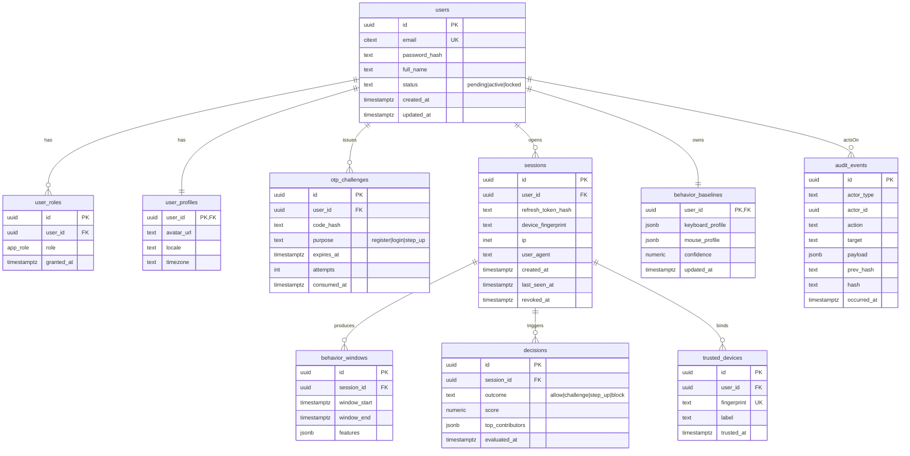

# Database Design — ERD & Strategy

**Engine:** PostgreSQL 16 (OLTP) · **Cache/Session:** Redis 7 · **Analytics:** ClickHouse · **Cold:** S3

## Schemas

- `public` — application tables (RLS enforced).
- `audit` — append-only ledger, chain-hashed.
- `ml` — model registry pointers, feature snapshots, decisions.
- `ops` — feature flags fallback, queues metadata.

## Sprint 1 Core ERD

## Indexes

| Table | Index | Reason |
| --- | --- | --- |
| `users` | `UNIQUE (email)` | Lookup, uniqueness |
| `user_roles` | `UNIQUE (user_id, role)` | Idempotent grants |
| `otp_challenges` | `(user_id, purpose, expires_at DESC)` | Latest unconsumed lookup |
| `sessions` | `(user_id, revoked_at) WHERE revoked_at IS NULL` | Active sessions |
| `sessions` | `(refresh_token_hash)` | Refresh rotation |
| `trusted_devices` | `UNIQUE (user_id, fingerprint)` | Dedup |
| `behavior_windows` | `(session_id, window_start DESC)` | Recent windows |
| `decisions` | `(session_id, evaluated_at DESC)` | Session timeline |
| `audit_events` | `(occurred_at DESC)`, `(actor_id, occurred_at DESC)` | Audit scans |

## Constraints

- `users.email` CITEXT + CHECK length ≤ 254.
- `otp_challenges.attempts` CHECK between 0 and 5.
- `decisions.outcome` CHECK in enum.
- Every public-schema table has `GRANT` to `authenticated` + `service_role` per repo policy.

## RLS Sketch (public tables)

- `users`: user can `SELECT` only own row; admins (`has_role('admin')`) full read.
- `user_roles`: user can `SELECT` own roles; only admins INSERT/UPDATE/DELETE.
- `sessions`, `trusted_devices`, `behavior_baselines`, `behavior_windows`, `decisions`: scoped to `auth.uid()`; admins read-all.
- `audit_events`: no writes from app role — only `service_role` (relay).

## Retention

| Data | Hot (Postgres) | Warm (ClickHouse) | Cold (S3) | Total Retention |
| --- | --- | --- | --- | --- |
| OTP challenges | 24 h | — | — | 24 h then purge |
| Sessions | 30 d | 180 d | 7 y (audit subset) | 7 y |
| Behavior windows | 7 d | 90 d | — | 90 d |
| Behavior baselines | indefinite (per user) | — | — | until deletion request |
| Decisions | 90 d | 13 mo | 7 y | 7 y |
| Audit events | 90 d | 13 mo | 7 y (Glacier after 90 d) | 7 y |

User-initiated deletion (GDPR Art. 17) purges hot + warm; audit retains hashed pseudonyms only.

## Encryption Strategy

- **At rest:** Postgres TDE via AWS RDS/Aurora; S3 SSE-KMS; ClickHouse disk encryption.
- **Field-level:** `password_hash` (Argon2id), `otp_challenges.code_hash` (HMAC-SHA256 with KMS-managed key), `sessions.refresh_token_hash` (HMAC-SHA256).
- **In transit:** TLS 1.3 everywhere; mTLS service-to-service inside the mesh.
- **Keys:** AWS KMS, automatic annual rotation, per-environment isolation.

## Audit Strategy

- `audit_events` is append-only. `hash = sha256(prev_hash || canonical(payload))`.
- Daily anchor: latest hash written to S3 Object Lock + emitted to a public transparency log.
- Admin reads through `/admin/audit`; verifier job runs hourly and alerts on chain break.

## Migrations

- Tool: `sqlx` migrations under `db/migrations/` (sequential, timestamped).
- Every migration that creates a public table includes the GRANT block per repo policy (see Master PRD §10).
- Migrations are forward-only; rollback via compensating migration.
